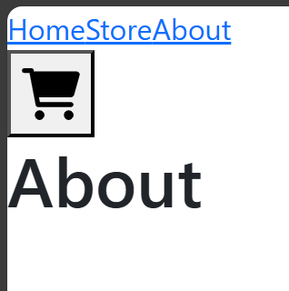

Adianto que não consegui entregar a atividade. Tive muitos problemas com a atividade em relação a compatibilidade dos componentes do Tailwind com o Vite. Também nunca tinha desenvolvido nada com React antes, apesar de ter achado a experiência de tentar desde sexta sem parar, estudando teoria e prática, cheguei no deadline e tenho apenas algumas páginas desestruturadas. 

Consegui fazer as três páginas que pretendia fazer mas sempre que tentava aplicar comandos do booststrap ou do tailwind dava alguma coisa errada ou não funcionava. 

Espero que a falta dessa entrega não faça com que eu seja descontinuado do Rocket, mas eu diria que essa frustração depois de tanto trabalho e tanta coisa dando errado só fez com que eu queira mais e me aprofunde mais nos conteúdos. Quero muito essa oportunidade, preciso dessa oportunidade e não pretendo falhar novamente nem prejudicar a minha equipe na fase do projeto. 

Peço o voto de confiança da equipe do rocket e asseguro a todos que estiverem lendo que o que eu escrevo aqui é pra valer, e pretendo provar o meu valor até o final desse projeto

